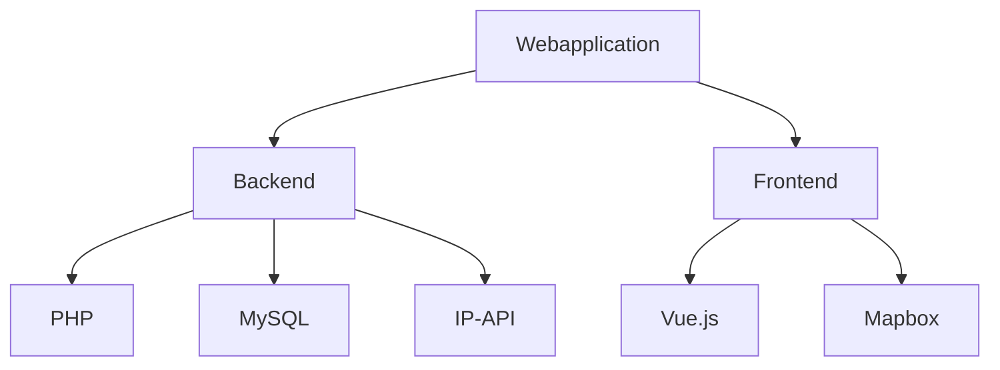

# ReadMe

## Inhalt
-   Projektarchitektur mit Diagramm
-   Requirementsanalyse (User Stories, FR, NFR)
-   Beschreibung Datensatz (Quelle, Format, Inhalt, Sample)
## Projektarchitektur

## Requirementsanalyse

****User stories****
Als User will ich mich über die funktionsweise eines Netzwerks informieren um diese im Grundsatz zu verstehen.
Als User will ich den Weg von meiner IP bis zur aufgerufenen Webseite verfolgen können und diesen verständlich dargestellt haben, um mir so einen Überblick verschaffen zu können.

****Functional requirements****
-   User kann beliebige Domain eingeben.
-   User kann durch Seite navigieren.
-   User kann durch Informationen scrollen.
-   User kann durch Karte (Mapbox) navigieren.
-   User kann Cookies Einstellungen vornehmen.

****Non-functional requirements****
-   Responsiveness
-   Performance
-   Supported Browser (Chrome, Firefox, Safari)
-   Multi-language support (German, English)

## Datensatz

Geotargeting → IP-API: [https://ip-api.com/](https://ip-api.com/)
Infotexte & Bilder → Selber schreiben und illustrieren.
